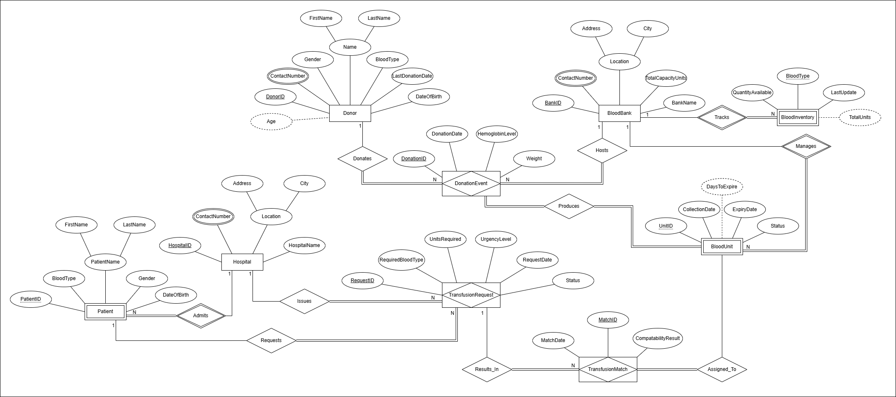
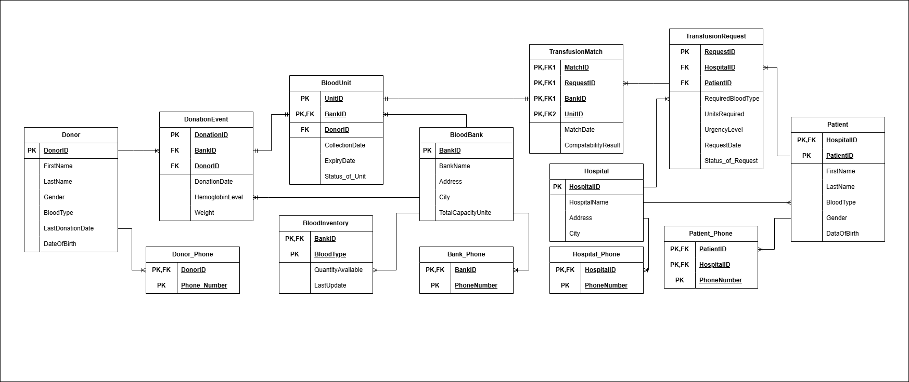

# 🩸 Blood Donation & Transfusion Database System

<div align="center">


**A comprehensive relational database system designed to digitize blood bank operations — streamlining everything from donor registration to life-saving inventory tracking, from donation to transfusion.**

</div>

---

## 📋 Table of Contents

- [Overview](#-overview)
- [Features](#-features)
- [Database Schema](#-database-schema)
- [Diagrams](#-diagrams)
- [Project Structure](#-project-structure)
- [Getting Started](#-getting-started)
- [SQL Highlights](#-sql-highlights)
- [Team](#-team)

---

## 🔍 Overview

Manual blood bank management systems are error-prone and time-critical failures can cost lives. This project addresses that risk by providing a **centralized, normalized relational database** that:

- Eliminates data redundancy through **3rd Normal Form (3NF)** design
- Enforces **referential integrity** with foreign key constraints
- Automates **ABO/Rh compatibility logic** via stored procedures
- Maintains **real-time blood inventory** through database triggers
- Tracks the complete lifecycle of every blood unit — from **donor → bank → patient**

---

## ✨ Features

| Feature | Description |
|---|---|
| 🧑‍🤝‍🧑 **Donor Management** | Secure donor profiles with eligibility tracking via last donation date and age validation |
| 🏥 **Hospital Request Pipeline** | Registered hospitals submit, track, and update blood transfusion requests |
| 🩸 **Real-Time Blood Inventory** | Automatic inventory updates triggered on every unit insert/delete |
| 🔗 **Transfusion Matching** | Stored procedure pairs blood units with requests using ACID transactions |
| 📜 **Immutable Transfusion History** | Full audit trail from donor to receiving patient |
| ⏰ **Expiry Tracking** | Dynamic view computes real-time unit expiry without storing derived data |
| 🔐 **Role-Based Access Control** | DBA, Hospital Staff, and Medical Analyst roles with least-privilege enforcement |
| ✅ **Donation Validation** | Trigger rejects donations outside legal age (18–65) or hemoglobin thresholds |

---

## 🗄️ Database Schema

The system consists of **13 tables** across three core domains:

### Entities

```
Donor               — Donor profiles and blood types
Donor_Phone         — Multi-valued phone numbers (1NF compliance)
BloodBank           — Blood bank facilities and capacity
Bank_Phone          — Blood bank contact numbers
Hospital            — Registered hospitals
Hospital_Phone      — Hospital contact numbers
Patient             — Weak entity linked to Hospital
Patient_Phone       — Patient contact numbers
BloodUnit           — Individual blood bags (weak entity under BloodBank)
BloodInventory      — Real-time stock per blood type per bank
DonationEvent       — Donor ↔ BloodBank intersection with health metrics
TransfusionRequest  — Hospital orders on behalf of patients
TransfusionMatch    — Final pairing of request with blood unit
```

### Normalization

- **1NF** — Multi-valued phone numbers extracted into separate bridge tables
- **2NF** — All non-key attributes depend on the full composite key
- **3NF** — Derived attributes (`Age`, `ExpiryStatus`) removed; computed dynamically via Views and `TIMESTAMPDIFF()`

---

## 📊 Diagrams

### Entity-Relationship Diagram (ERD)


### Relational Model


---

## 📁 Project Structure

```
Blood-Donation-Transfusion-Database-System/
│
├── 📂 Code/
│   └── (SQL scripts and supporting code files)
│
├── 📂 Diagrams/
│   ├── ER-Diagram.png
│   └── Relational-Model.png
│
├── 📄 Blood_Donation_and_Transfusion_Database.sql   ← Main SQL script
├── 📄 Blood Donation and Transfusion Database System.pdf  ← Full report
├── 📄 Blood Donation and Transfusion Database System proposal.pdf
├── 📄 LaTeX code.txt                                ← LaTeX source for report
└── 🌐 LifeFlow — Donate Blood. Save Lives..html     ← Project landing page
```

---

## 🚀 Getting Started

### Prerequisites

- [MySQL 8.0+](https://dev.mysql.com/downloads/mysql/) or [MySQL Workbench](https://dev.mysql.com/downloads/workbench/)

### Installation

1. **Clone the repository**
   ```bash
   git clone https://github.com/AbdoTarekH1/Blood-Donation-Transfusion-Database-System.git
   cd Blood-Donation-Transfusion-Database-System
   ```

2. **Open MySQL Workbench** (or your preferred MySQL client)

3. **Run the main SQL script**
   ```sql
   source Blood_Donation_and_Transfusion_Database.sql;
   ```
   This will automatically:
   - Create the `Blood_Donation_and_Transfusion_Database` schema
   - Create all 13 tables with constraints
   - Insert sample data (20+ records per table)
   - Create triggers, stored procedures, and views

4. **Verify the setup**
   ```sql
   USE Blood_Donation_and_Transfusion_Database;
   SHOW TABLES;
   SELECT * FROM View_BloodUnit_Status;
   ```

---

## 💡 SQL Highlights

### Stored Procedure — Transfusion Match (ACID Transaction)
```sql
CALL ProcessTransfusionMatch(
    new_match_id      => 21,
    target_request_id => 5,
    target_unit_id    => 8,
    target_bank_id    => 3
);
-- Atomically: Reserves the unit, updates request status, logs the match.
-- On any failure: full ROLLBACK is triggered automatically.
```

### Trigger — Donation Eligibility Validation
```sql
-- Fires BEFORE INSERT on DonationEvent
-- Rejects if: donor age < 18 or > 65
-- Rejects if: hemoglobin < 13.0 g/dL (male) or < 12.5 g/dL (female)
```

### View — Real-Time Expiry Status
```sql
SELECT * FROM View_BloodUnit_Status
WHERE FinalStatus = 'Expired';
-- Dynamically computes expiry by comparing ExpiryDate with CURDATE()
-- No stale data — always accurate without manual updates
```

### Key Queries
```sql
-- Find hospitals with critical blood requests
SELECT HospitalName FROM Hospital
WHERE HospitalID IN (
    SELECT HospitalID FROM TransfusionRequest
    WHERE UrgencyLevel = 'Critical'
);

-- Count all currently available blood units
SELECT COUNT(*) AS AvailableUnits
FROM BloodUnit WHERE Status_of_Unit = 'Available';

-- Full patient-request-hospital join
SELECT CONCAT(p.FirstName, ' ', p.LastName) AS Patient,
       r.RequiredBloodType, h.HospitalName
FROM TransfusionRequest r
JOIN Patient  p ON r.PatientID  = p.PatientID
JOIN Hospital h ON r.HospitalID = h.HospitalID;
```

---

## 👥 Team

| Name | Student ID | Email |
|------|-----------|-------|
| Ahmed Hossam Mohamed Ezz-Eldin Mohamed | 248141 | ahmed.hossam19@msa.edu.eg |
| Ahmed Amr Ahmed Ismail Jabr | 241659 | ahmed.amr26@msa.edu.eg |
| Abdelrahman Tarek Gamal Kilany Haggag | 248761 | abdelrahman.tarek15@msa.edu.eg |

**Supervised by:** Dr. Ahmed Ayoub
**Course:** Fundamentals of Database Systems — CSE462a / CSE242
**Institution:** MSA University (October University for Modern Sciences and Arts)
**Semester:** Spring 2026

---

<div align="center">
  <sub>Built with ❤️ for CSE462a — Fundamentals of Database Systems</sub>
</div>
